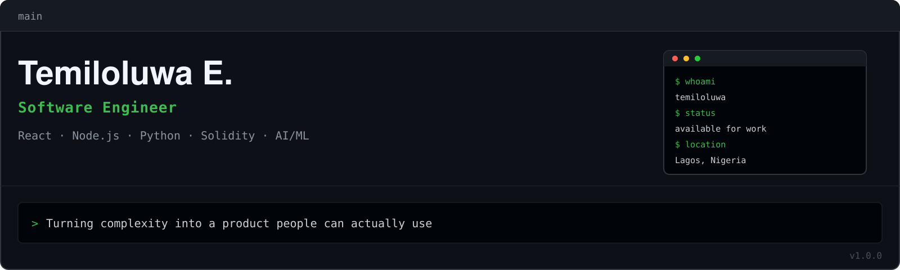

  

 

  

 

Software engineer in Lagos, Nigeria. I write full-stack code and ship it myself — front end, back end, and whatever AI or blockchain piece the product actually needs.

Started at 12 with basic HTML and JS pages nobody asked for. Never really stopped. What kept me going wasn't the code itself, it was the moment something I built turned into a thing someone who isn't a developer could just use.

Most of what's here isn't a class assignment or a tutorial follow-along — it's a product I decided needed to exist, then built end to end because there was no one else to hand the other half to.

## Stack I actually use

- **React / Next.js** — the front end for everything, because I'd rather spend my time on the product than re-litigate tooling choices.
- **TypeScript** — on anything that's going to outlive the first week.
- **Node.js / Express** — the API layer, paired with Postgres or Mongo depending on how relational the data actually is.
- **Python** — pandas, NumPy, PyTorch, OpenCV, for the AI/ML side I'm going deeper on right now.
- **Solidity / Rust** — for the projects where a chain has to sit underneath the product, not instead of it.
- **Java / Spring Boot / C** — the part of the stack that doesn't get a spotlight but shows up when a project needs it.
- **Docker / Kubernetes / Kafka** — for when "it works on my machine" isn't good enough anymore.
- **Git and GitHub** — no ceremony, just commits that say what actually changed.

## Selected projects

[**ProDesign Africa**](https://github.com/darkmonarch123/ProdesignAfrica) — A 3D architecture builder so students, firms and people with zero CAD experience can design a building through a browser. Nigerian plot standards and ARCON/LASDRI compliance baked into the tool, not bolted on after.

[**Pinnacle Inc**](https://github.com/darkmonarch123/PinnacleCorp) — A paper-trading platform for African investors: real market data, a real order desk, a $10,000 virtual balance, and none of the risk while you learn.

**NairaX Signal Pro** — A memecoin signal bot that scans 340+ new coins an hour across Solana, BSC and Ethereum, scores each one 0–100 across 7 signals, and tells Nigerian users which ones are worth a second look — Telegram bot and web dashboard, free and premium tiers.

**NewHope Hospital System** — Appointment tracking and ward sorting for a hospital that was running on paper trails before this existed.

[**UNICCREATIONS**](https://github.com/darkmonarch123/uniccreations-style-hub) — E-commerce storefront for a Lagos-made fashion brand. I matched their design reference down to the spacing, then built the shop logic behind it. Front end and back end, no separate hire for either.

## Currently

Going deeper on AI/ML and blockchain — not as separate interests, as the same interest: turning something complicated into a product a normal person can pick up and use. Also studying Petroleum Engineering at the University of Lagos, because systems are systems whether they're made of code or pipe.

## 📊 Activity

  
  

  

## Contact

Email is the fastest way to reach me: **emmanueltemiloluwa441@yahoo.com**. Also on [LinkedIn](https://ng.linkedin.com/in/temiloluwa-emmanuel-oluwanifemi-9628532a7) and [X](https://x.com/iam_temiloluwa7) if that's easier for you.

Open to new projects right now. If you need someone who'll own the whole thing instead of just their half of it, that's usually me.

## A note on licence

Code here is MIT unless a repo says otherwise — use it, fork it, ship it in your own product, no credit required. If you want to talk before that, my inbox is open.
